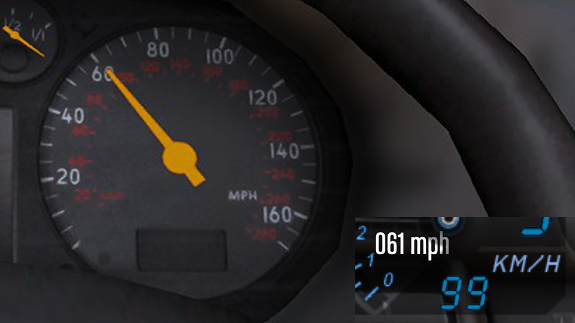

# Dial Accuracy Fix

Grand Theft Auto V script that allows customizing dashboard speedometer and RPM values.

Mostly intended to fix wrong speedometer mapping on add-on vehicles.

Example result on the [Audi S3 by Wanted188](https://www.gta5-mods.com/vehicles/audi-s-3-02-riceable-wanted188):



## Requirements

* Grand Theft Auto V
* [ScriptHookV](http://www.dev-c.com/gtav/scripthookv/)
* [DashHook](https://www.gta5-mods.com/tools/dashhook)

## Usage

* Vehicle models can be added to the `DialAccuracyFix/settings.ini` file.
* Configs can be reloaded by entering the cheat defined in `settings.ini`

An example of an entry:

```ini
[audis32]
SpeedScale = 1.1225
SpeedOffset = 0.0
RPMScale = 1.40
RPMOffset = 0.0
```

* Section is the model name
* SpeedScale multiplies the current speed
* SpeedOffset adds a constant to the current speed, in MPH
* RPMScale multiplies the current RPM
* RPMOffset adds a constant to the current RPM, in ratio: 0.1 adds 10%.

Notes:

* The speedometer dial is still limited to its max of 200 MPH, so you can not extend the range.

## Thanks

* alloc8or - The function location and the struct
* Eddlm - Script name!

